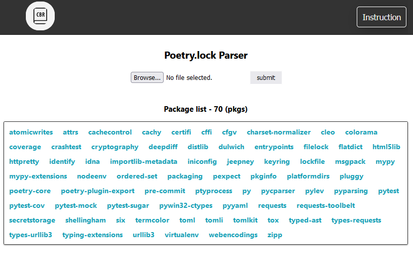
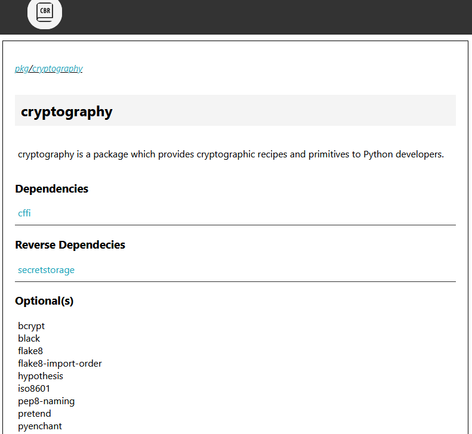

## POETRY LOCK PARSER

### Description

Poetry lock parser
[poetry.lock](./storage/poetry.lock) to database and filter the database by using search bar

### Layout




### Backend

- NodeJS, ExpressJS
- express-fileupload
- concurrently

### Frontend

- ReactJS
- [component diagram](./frontend/README.md)

### Deployment

- [heroku](https://poetry-lock-parser.herokuapp.com/)

### Setup

> install dependencies

```
    npm install
```

> run web app

```
    npm run dev
```
