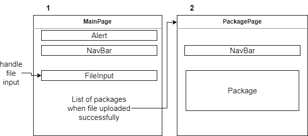

### Component Diagrams



### Used Modules

- axios
- react-router-dom

### Run in local

> current directory is client/

```
    npm start
```

Runs the app in the development mode.\
Open [http://localhost:3000](http://localhost:3000) to view it in your browser.
